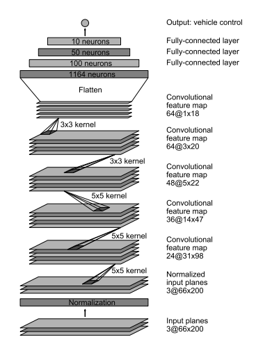
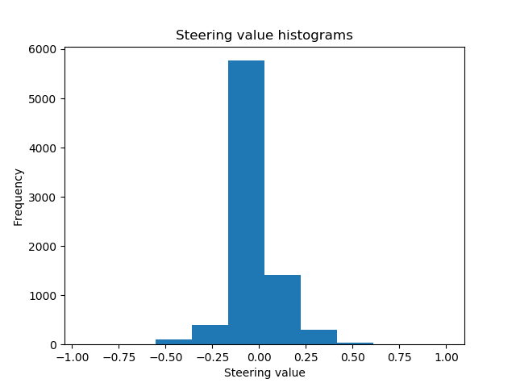
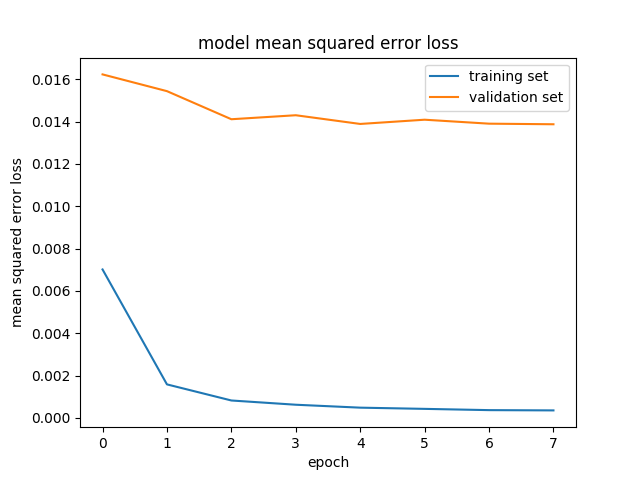

# **Behavioral Cloning** 


The goals / steps of this project are the following:
* Use the simulator to collect data of good driving behavior
* Build, a convolution neural network in Keras that predicts steering angles from images
* Train and validate the model with a training and validation set
* Test that the model successfully drives around track one without leaving the road
* Summarize the results with a written report
  
---
## Files Submitted & Code Quality
### 1. Submission includes all required files and can be used to run the simulator in autonomous mode

The workspace includes the following files:
* `model.py` containing the script to create and train the model
* `drive.py` for driving the car in autonomous mode
* `model.h5` containing the trained convolution neural network 
* `writeup.md` summarizing the results
* `MSEL.png` showing the MSEL for validation and training errors
* `Nvidia_architecture.png` showing the NVIDIA architecture which has been used as reference network 
* `center_2016_12_01_13_30_48_287.jpg` sample image of the dataset 
* `center_2016_12_01_13_30_48_404.jpg` another sample image of the dataset
* `Histogram.png` histogram showing the original dataset steering values and their frequency 

### 2. Submission includes functional code
Using the Udacity provided simulator and the `drive.py` file, the car can be driven autonomously around the track by executing :
```sh
python drive.py model.h5
```
### 3. Submission code is usable and readable

The `model.py` file contains the code for training and saving the convolution neural network. The file shows the pipeline I used for training and validating the model, and it contains comments to explain how the code works.

## Model Architecture and Training Strategy

My final model is based on the NVIDIA architecture also shown in the video lessons:



####Parameters for each layer:

| Layer (type)                 | Output Shape            |  Param    |
|:----------------------------:|:-----------------------:|:---------:|
| lambda_1 (Lambda)            |   (None, 160, 320, 3)   | 0         |      
| cropping2d_1 (Cropping2D)    | (None, 65, 320, 3)      |   0       |         
| conv2d_1 (Conv2D)            | (None, 31, 158, 24)     |    1824   |      
| conv2d_2 (Conv2D)            | (None, 14, 77, 36)      |  21636    |
| conv2d_3 (Conv2D)            | (None, 5, 37, 48)       |  43248    | 
| conv2d_4 (Conv2D)            | (None, 3, 35, 64)       |  27712    | 
| conv2d_5 (Conv2D)            | (None, 1, 33, 64)       |  36928    | 
| flatten_1 (Flatten)          | (None, 2112)            |  0        | 
| dense_1 (Dense)              | (None, 100)             |  211300   | 
| dense_2 (Dense)              | (None, 50)              |  5050     | 
| dense_3 (Dense)              | (None, 10)              |  510      | 
| dense_4 (Dense)              | (None, 1)               | 11        |

- Total params: 348,219
    - Trainable params: 348,219
    - Non-trainable params: 0

The original dataset samples are _24108_. After flipping the images they become _24108 * 2 = 48216_ and after adding the side cameras
we have a total number of samples of _48216 * 3 = 144468_ 
_________________________________________________________________

####Changes attempted on the architecture
I tried several modifications, including changing the number of neurons in the last 3 fully connected layers. I tried adding 10 and then 20 neurons to each layer with and without adding dropout layers (0.2 probability) but the original NVIDIA model has always performed better.
I added a cropping layer in order reduce the amount of useless data fed to the network which in this case was the car hood and the landscape.
The model was trained and validated on different data sets with a ratio of 0.2 (20% of the data composing the validation set, 80% composing the training set) 
I used the adam optimizer therefore not modifying the learning rate by hand.
With the tested model I verified that the vehicle could stay on the track by running the simulator in autonomous mode.

To reduce the possibility of overfitting I could have done two more things:
- Record a lap going in the other direction and feed these recorded data to the network.
- Record a lap in the second track and feed these recorded data to the network.

#### 4. Appropriate training data

I used only the original set without recording new laps. The original training test set has been augmented by flipping the images horizontally and taking the opposite sign of the steering measurement.
Moreover I used all the cameras correcting the side ones with a correction factor of 0.2.

Samples images of the used dataset:


Histogram of the dataset BEFORE augmentation:


Finally here there are validation and training errors per epoch:
